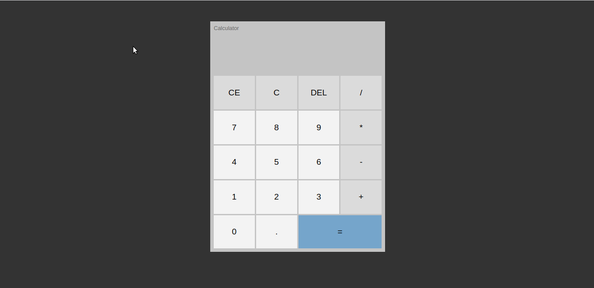

# Calculator Windows 🔢🔢🔢🔢

> # Description / Descrição

A calculator with it's design inspired by the one present in the Windows OS. The functionality of the calculator was built with Object Oriented Programming (OOP).

[🔗 Click here to access / Clique aqui para acessar](https://calculator-vitorfnery.netlify.app/)

## 🛠️ Technologies / Tecnologias

- JavaScript
- HTML
- CSS
- Git and Github

## 📣 Contact / Contato

vitorfelipenery@gmail.com
